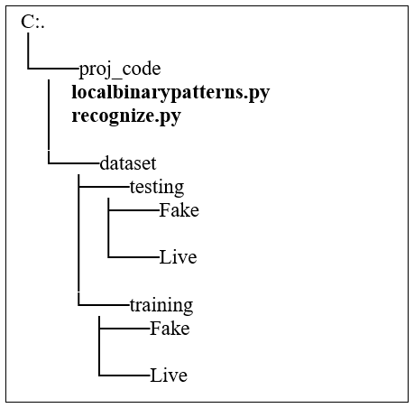

A two-class fingerprint spoof detector that uses Local Binary Patterns (LBP) features along with Support Vector Machines (SVM) to distinguish live fingerprints images from spoof samples.

Fake fingers can be easily fabricated using commonly available materials, such as latex, silicone, and gelatin, with the fingerprint ridges of an individual engraved on it. These fake fingers can then be used by an adversary to launch a spoof attack by placing them on a fingerprint sensor and claiming the identity of another individual. The success rate of such spoof attacks can be up to 70%. Fingerprint spoof detection algorithms have been proposed as a counter-measure against spoof attacks. A fingerprint spoof detector is a pattern classifier that is used to distinguish a live finger from a fake (spoof) one in the context of an automated fingerprint recognition system. Most liveness detectors are learning-based and rely on a set of training images.

Python Packages to be Installed:
scipy, numpy, matplotlib-->	pip install scikit-image
imutils-->	pip install imutils

Execution Command on Command Prompt:
python recognize.py --training dataset/training --testing dataset /testing
OR
python recognize.py -t dataset/training -e dataset /testing
